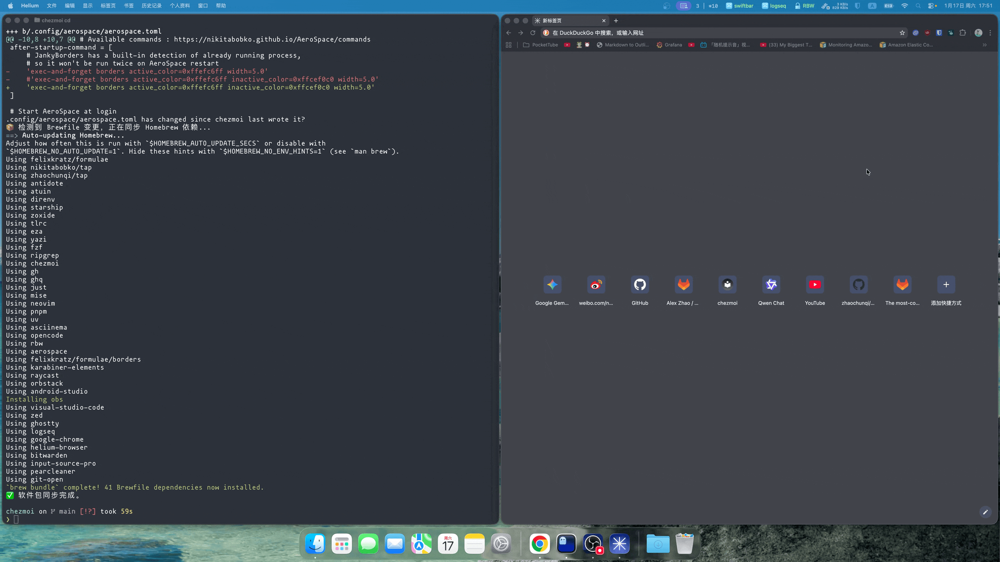

在 macOS 下配置如下参数，可以使用快捷键 `ctrl+cmd`来在任意位置拖拽窗口，而不是仅仅通过标题栏。

```bash
defaults write -g NSWindowShouldDragOnGesture YES
```



参考链接：https://www.reddit.com/r/MacOS/comments/k6hiwk/keyboard_modifier_to_simplify_click_drag_of/
